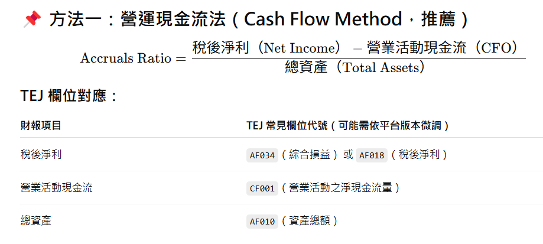

# FM_project

time horizon : 2000/01/01-2024/12/31 (論文從1957-2016, 考量台股市場成熟性,決定使用24年內時間資料,真實理由只是覺得湊個整數挺不錯的)
target : 上市, 普通股(不含TDR+KY), 400th market value in 2000/01/01-2024/12/31(從1995/01/01開始撈資料避免資料截斷問題), 要記得撈財報發布日期
IFRS data :
	現金及約當現金
	資產總額
	負債總額
	股東權益總額
	營業毛利
	ROA(A)稅後息前
	ROE(A)-稅後
	每股盈餘
	來自營運之現金流量
	營運槓桿度
	財務槓桿度
	稅後淨利率
	營業成本

股價 data :
	收盤價(元)_月
	市值(百萬元)
	本益比-TEJ
	股價淨值比criteria :
    profitability
    growth
    safety

formula & definition

size breakpoint :80th percentile by country

gpoa : gross profit over assets
roe : return on equity
roa : return on assets
cfoa : cash flow over assets
gmar : gross margin
acc : minus accruals (the fraction earnings composed of cash)

delta : five-year growth
bab : companies with low beta(betting against beta)
lev : companies with low leverage
o : low bankruptcy risk
z : low bankruptcy risk
evol : low roe volatility

profitability = z(Zgpoa + Zroe + Zcfoa + Zgmar + Zacc) (formula 2)
growth = z(Zdelta of gpoa + Zdelta of roe + Zdelta of cfoa + Zdelta of gmar + Zdelta of acc) (formula 3)
safety = z(Zbab + Zlev + Zo + Zz + Zevol) (formula 4)
quality = z(profitability + growth + safety) (formula 5)

assigned stock in each country to ten quality-sorted portfolios, value-weighted, refreshed every calender month, rebalance every calender month to maintain value weights

QMJ portfolios = 0.5(small quality + big quality) - 0.5(small junk + big junk) (formula 7)

control variable : industry, country, firm-fixed effect(???)

p(i, t) = a + b * quality + controls + epsilon, p(i, t) = log(MB), MB = current market equity in JUNE / book equity
rt = alpha + beta(for mkt) * MKT + beta(for smb) * SMB + beta(for umd) * UMD + epsilon (formula 10)
後半段結果我懶得看

程式流程
encoding : 更改編碼方法，使vscode就能打開預覽器，將fnd與price做成fnd2跟price2
merge : 資料合併，對齊，將fnd2與price2做成merge
first_backfill : 填補缺失值，由於我就爛，所以填法有待改進，先對文字類資料groupby公司名稱往前往後回填，對數字類資料groupby公司名稱線性補值，再groupby產業代號groupmean回填，存出first_backfill
接下來，寫新的make.py，利用database/first *backfill.csv製作出database/make.csv
裡面只需要以下欄位 : ["證券代碼", "年月", "收盤價(元)* 月", "公司名稱", "gpoa", "roe", "cfoa", "gmar", "acc"], gpoa為"營業毛利" / "資產總額", roe為"ROE(A)-稅後", cfoa為"現金及約當現金" / "資產總額", gmar為"營業毛利" / ("營業毛利" + "營業成本"), acc為"來自營運之現金流量" / ("稅後淨利率" * ("營業毛利" + "營業成本")

程式支線任務
coverage_analyze : merge之後，分析資料覆蓋率，存出merged_data_coverage_by_ym
